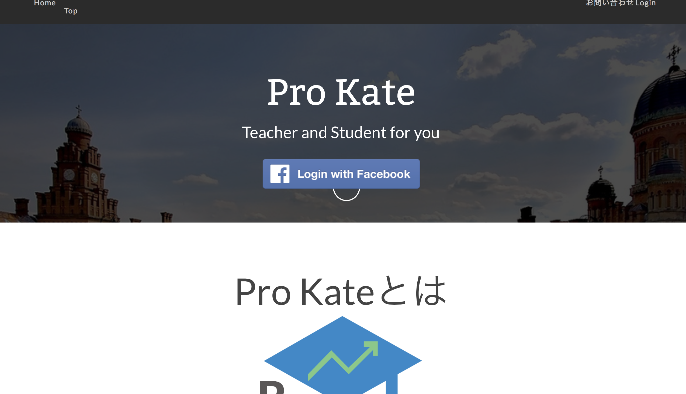

# Pr/Applications/MAMP/htdocs/prokateoKate cake version
##だいじゅくんに特にいじってほしいところ
だいきくんには、投稿・編集機能の実装をお願いしています。そのため、以下の2つの作業をお願いいたします。

- 講師プロフィール  
【ファイル場所】  
コントローラー app/Controller/TeachersController.php
モデル app/Model/Teacher.php   
ビュー app/View/Teachers/add.ctp, edit.ctp
- 生徒プロフィール
 【ファイル場所】  
コントローラー app/Controller/UsersController.php
モデル app/Model/User.php   
ビュー app/View/Users/add.ctp, edit.ctp


##ローカル開発環境設定
- [bitbucket](https://bitbucket.org/appitg/prokate_cake)  
こちらで自分PCの適当な場所にレポジトリー作成してpullしてください。  
- ローカル開発環境(MAMP, Vagrant)  
phpを用いているので必須です。phpmyadminやmysqlが用意できる場所を用意しておいてください。
- データベースの設定
「インポート」という方法でこちらのファイルをダウンロードしてデータベースを立ててください。  
[sqlファイル](README/prokate.sql)

##サーバー
- [テストサーバーurl](http://appart-linux.cloudapp.net/cake_prokate/)

###pushする際の注意
git add .  
とすると、キャッシュファイルが絶賛コンフリクトしてしまうエラーがおきているので  
git add (編集したファイル名)
としてください。  
それぞれ編集したもののみをadd->commit->pushしてください。


##システム全体像

cakePHPでは、主に3つのフォルダをいじります。

- Model: サーバーとのデータのやりとり
- Controller: ModelとViewの橋渡し（ロジック部分）
- View: 見た目のhtmlの出力

サーバーサイドを担当する人はModel, Controllerをいじることが多くて、フロントサイドを担当する人はController, Viewをいじることが多いかと思います。


##フロント側
###トップページ

pass : prokate/index.php  
トップページは上記のファイルにて記述  
しかし、head部分やnav, footerなどは別ファイルから参照している（詳細は後述）
###共通部分
サービスを通して共通している部分はElementというcakePHPの技を使って記述
####ナビゲーションバー
pass : prokate/app/View/Elements/navbar.ctp  
navbar.ctpを見るとナビゲーション部分のみのコードが確認できる。メニューバーをいじりたいときはこちらで記述
###フッター
pass : prokate/app/View/Elements/footer.ctp  
footer.ctpにてフッター部分の記述。

###画像とかcssとかjsとかってどこにあるの？
画像とかの静的ファイル（毎回全く変化しないファイル）は以下のパスに格納されます。

pass : app/webroot
例えばcssファイルはcssのなか、画像ファイルはimg、jsファイルはjsという要領です。  
ちなみに、これらのよびだしかたもHTMLHelperというcakephpの技法で呼び出します。コードを書く量減っておすすめです。（今は全部先立って設定しているので気にしなくていいです。）  
####実際コードを書く場所
cssをいじりたい場合  
app/webroot/css/style.cssに書いていってください。  

jsをいじりたい場合  
app/webroot/css/script.jsに書いていってください。

###便利な小技達
####リンクを貼る


#####HTMLではこの記述のところ  
```
<a href="">???</a>
```
できるだけ相対パスで記述したほうが保守性が高い。cakePHPでは決まり文句的な書き方があるのでそちらを紹介。  
#####cakephpでの書き方
######例1

```
<?php echo $this->Html->link('Top', '/'); ?>
```  
例えばこう書くとHTML部分では、  

```
<a href="/prokate/">Top</a>
```  

となるのでトップページのindex.phpに行きます。

######例2
「講師のマイページに飛びたい」とか「生徒のログイン画面に飛びたい」とかが主なニーズですよね。  
そのときは、この公式を覚えればおけです。
  
```
<?php echo $this->Html->link('表示したい内容', array('controller' => 'コントローラーの名前', 'action' => 'アクションの名前'); ?>
```  

コントローラーっていうのは、いわゆる「講師」なのか「生徒」なのかどの機能部分を使うのかっていう話です。  
アクションっていうのは「講師」機能の特にどの画面・処理へ飛ばしたいのかっていうことです。 
 
例えば、講師の追加登録画面にリンクを飛ばしたい場合を考えてみましょう。  
この場合は、講師機能はTeachersController.phpとかなのでControllerの名前はteachersです。  
そしてTeachersController.phpを開いてみるとこんなファイルです。

  
action名っていうのは「public function」の後のヤツです。indexとかviewとかaddです。  

- index(): 講師機能のトップページ（講師情報の一覧できる場所)
- view(): 講師個別のマイページ
- add(): 登録

とそれぞれ画面ごとにアクションっていうのがあります。これを指定すればリンクに飛べます。  

さて、今回の例は「講師の追加登録画面にリンクを飛ばしたい。」なのでこうなります。  

```
<?php echo $this->Html->link('新規登録', array('controller' => 'teachers', 'action' => 'add')); ?>
```


[HTMLヘルパーcookbook](http://book.cakephp.org/2.0/ja/core-libraries/helpers/html.html)  
詳細はこちら  


##バックエンド側
####データベースの設定、操作(find,set)
次のコマンドで、データベースの内容を取得し、モデルのインスタンス（モデルの機能を、所定の条件で持たせたオブジェクト）を、viewに生成します。
  
######例3 全て持ってくる
```
$this->set('user', $this->User->find('all'); //ユーザーモデルの全ての情報 。
//viewでは、$userというインスタンスが生成される。
```  

######例4　指定のidを持ってくる
```
$this->set('user', $this->User->findById($id)); //ユーザーモデルの全ての,idカラムの値が$idのユーザー情報 
```  

######例5　特定の条件で持ってくる
```
  $params = array( //$paramsという情報に、以下の条件を持たせる。
        'order' => 'modified desc', //modefiedの最新順に上から表示するという指定
        'limit' => 20 //20件取得するという指定
      ); 
$this->set('user', $this->User->find('all', $params)); //$paramsという条件をもたせたUserモデルのインスタンス$userを、Viewに生成
```  

他にも、実際にSQL文で持ってくるなどの方法もあります。
詳細はこちら 
[findcookbook](http://book.cakephp.org/2.0/ja/models/retrieving-your-data.html)  


####viewでの書き方
Controllerのsetで命名した、
$インスタンス名[モデル名]['カラム名']で、dbのquery同様に、情報を取ってこれます。
######例6
```
//例4で、$id=4とした場合。//[setを含んだfunction名].ctpにて
echo $user['User']['name']; //Userモデルのカラムのidの値が4の、nameカラムの値が表示される。
//= mysql_db_query("所定のdb","select name from users where id = 4");
``` 

##Component(コンポーネント)
####AuthComponent
ユーザーログイン認証の実装を行うComponent。AppControllerに、共通の機能を実装する処理を実装し、各クラス(Controller)に継承させることで、機能の引き継ぎが行える。また、各クラスごとのAuthクラスメソッドに処理を施すと、継承先のクラスごとに固有の処理が行える。beforeFilterというメソッドは、各Controllerの関数を呼び出す前に呼び出される。このような処理により、認証などの前処理を行うことが出来る。
  
######例 ログインせずに画面を見る（Controllerの関数を呼び出す）許可
```
$this->Auth->allow('add', 'logout'); //addと、logoutという機能に関しては、ログイン認証なしに呼び出せる。 
```  
この機能があれば、同じ環境で、ログインを気にせずにいろんなViewの編集ができるので、覚えておくと便利。

##作業場所参照

###講師側機能実装部分  

- app/View/Teachers/
- app/Controller/TeachersController.php
- app/Model/Teacher.php

以上の3つのフォルダとファイルで具体的な機能を実装してます。

###生徒側機能実装部分
- app/View/Users/
- app/Controller/UsersController.php
- app/Model/User.php

###お問い合わせ機能実装部分
- app/View/Contact/
- app/View/Email/text/default.ctp
- app/Controller/ContactController.php
- app/Model/Contact.php