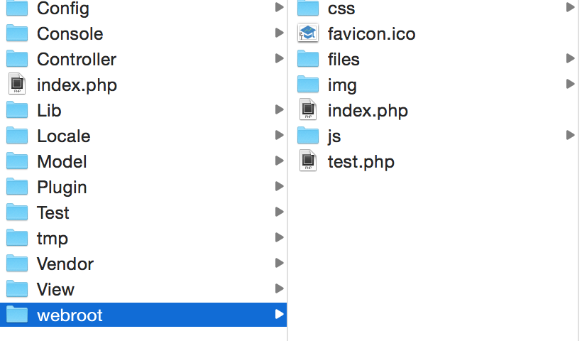
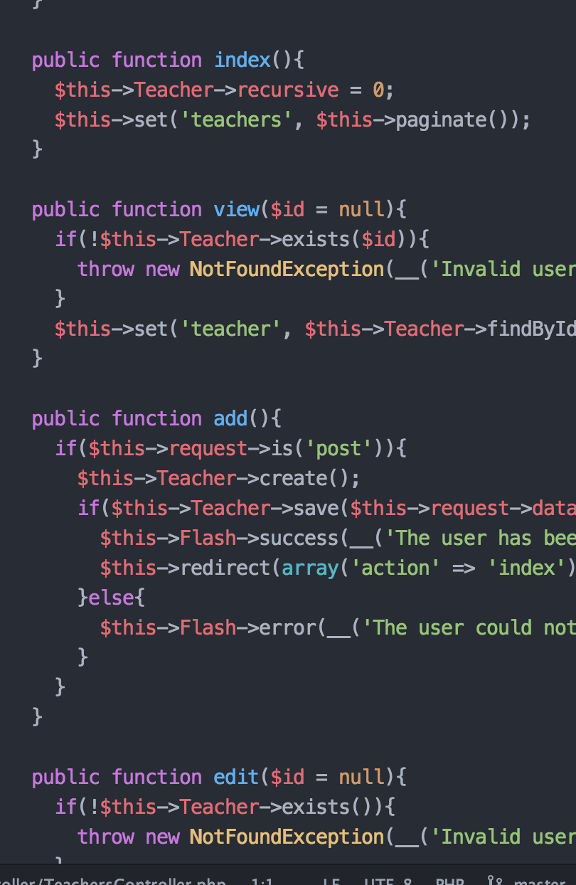

# ProKate cake version

##ローカル開発環境設定
- [bitbucket](https://bitbucket.org/appitg/prokate_cake)  
こちらで自分PCの適当な場所にレポジトリー作成してpullしてください。  
- ローカル開発環境(MAMP, Vagrant)  
phpを用いているので必須です。phpmyadminやmysqlが用意できる場所を用意しておいてください。
- データベースの設定
「インポート」という方法でこちらのファイルをダウンロードしてデータベースを立ててください。  
[sqlファイル](README/prokate.sql)

###pushする際の注意
git add .  
とすると、キャッシュファイルが絶賛コンフリクトしてしまうエラーがおきているので  
git add (編集したファイル名)
としてください。  
それぞれ編集したもののみをadd->commit->pushしてください。


##システム全体像

cakePHPでは、主に3つのフォルダをいじります。

- Model: サーバーとのデータのやりとり
- Controller: ModelとViewの橋渡し（ロジック部分）
- View: 見た目のhtmlの出力

サーバーサイドを担当する人はModel, Controllerをいじることが多くて、フロントサイドを担当する人はController, Viewをいじることが多いかと思います。


##フロント側
###トップページ

pass : prokate/index.php  
トップページは上記のファイルにて記述  
しかし、head部分やnav, footerなどは別ファイルから参照している（詳細は後述）
###共通部分
サービスを通して共通している部分はElementというcakePHPの技を使って記述
####ナビゲーションバー
pass : prokate/app/View/Elements/navbar.ctp  
navbar.ctpを見るとナビゲーション部分のみのコードが確認できる。メニューバーをいじりたいときはこちらで記述
###フッター
pass : prokate/app/View/Elements/footer.ctp  
footer.ctpにてフッター部分の記述。

###画像とかcssとかjsとかってどこにあるの？
画像とかの静的ファイル（毎回全く変化しないファイル）は以下のパスに格納されます。

pass : app/webroot
例えばcssファイルはcssのなか、画像ファイルはimg、jsファイルはjsという要領です。  
ちなみに、これらのよびだしかたもHTMLHelperというcakephpの技法で呼び出します。コードを書く量減っておすすめです。（今は全部先立って設定しているので気にしなくていいです。）  
####実際コードを書く場所
cssをいじりたい場合  
app/webroot/css/style.cssに書いていってください。  

jsをいじりたい場合  
app/webroot/css/script.jsに書いていってください。

###便利な小技達
####リンクを貼る


#####HTMLではこの記述のところ  
```
<a href="">???</a>
```
できるだけ相対パスで記述したほうが保守性が高い。cakePHPでは決まり文句的な書き方があるのでそちらを紹介。  
#####cakephpでの書き方
######例1

```
<?php echo $this->Html->link('Top', '/'); ?>
```  
例えばこう書くとHTML部分では、  

```
<a href="/prokate/">Top</a>
```  

となるのでトップページのindex.phpに行きます。

######例2
「講師のマイページに飛びたい」とか「生徒のログイン画面に飛びたい」とかが主なニーズですよね。  
そのときは、この公式を覚えればおけです。
  
```
<?php echo $this->Html->link('表示したい内容', array('controller' => 'コントローラーの名前', 'action' => 'アクションの名前'); ?>
```  

コントローラーっていうのは、いわゆる「講師」なのか「生徒」なのかどの機能部分を使うのかっていう話です。  
アクションっていうのは「講師」機能の特にどの画面・処理へ飛ばしたいのかっていうことです。 
 
例えば、講師の追加登録画面にリンクを飛ばしたい場合を考えてみましょう。  
この場合は、講師機能はTeachersController.phpとかなのでControllerの名前はteachersです。  
そしてTeachersController.phpを開いてみるとこんなファイルです。

  
action名っていうのは「public function」の後のヤツです。indexとかviewとかaddです。  

- index(): 講師機能のトップページ（講師情報の一覧できる場所)
- view(): 講師個別のマイページ
- add(): 登録

とそれぞれ画面ごとにアクションっていうのがあります。これを指定すればリンクに飛べます。  

さて、今回の例は「講師の追加登録画面にリンクを飛ばしたい。」なのでこうなります。  

```
<?php echo $this->Html->link('新規登録', array('controller' => 'teachers', 'action' => 'add')); ?>
```


[HTMLヘルパーcookbook](http://book.cakephp.org/2.0/ja/core-libraries/helpers/html.html)  
詳細はこちら  


##バックエンド側

##作業場所参照

###講師側機能実装部分  

- app/View/Teachers/
- app/Controller/TeachersController.php
- app/Model/Teacher.php

以上の3つのフォルダとファイルで具体的な機能を実装してます。

###生徒側機能実装部分
- app/View/Users/
- app/Controller/UsersController.php
- app/Model/User.php

###お問い合わせ機能実装部分
- app/View/Contact/
- app/View/Email/text/default.ctp
- app/Controller/ContactController.php
- app/Model/Contact.php