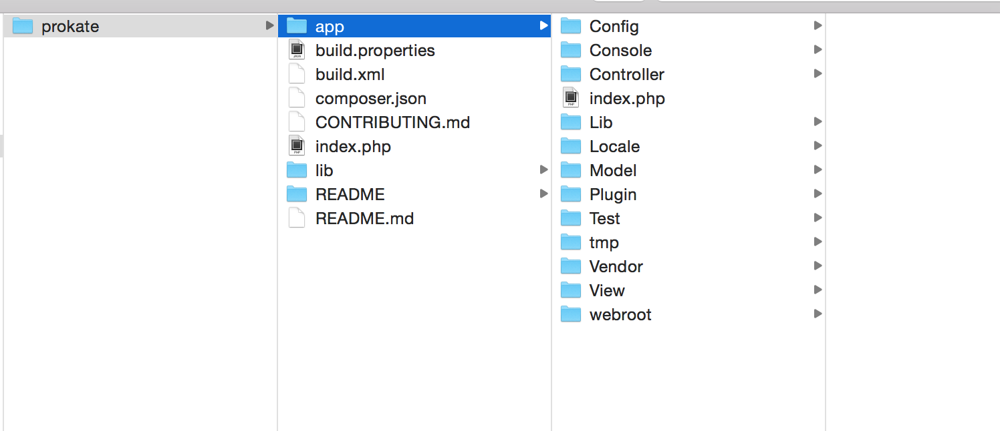

##マネポケイ仕様書
***
###メニュー

 
- ローカル開発環境(MAMP, Vagrant)  
phpを用いているので必須です。phpmyadminやmysqlが用意できる場所を用意しておいてください。

####git 使い方
clone (フォルダごと自分のパソコンに落とす)
クローンしたいディレクトリ場所に移動

`
git clone レポジトリurl(今回は　https://github.com/jphacks/KB_10.git)

`
　因みに,
フォルダのリモートレポジトリurl確認方法　

`
git remote -v

`

push(フォルダの中身をgithub上に上げる)

`
git add .  //←変更を加えたファイル名　.は、全てという意味

`

`
git commit -m “変更を加えた内容を書く

`

`
(1回目)
git push -u origin master

`
(2回目)
git push

pull 
(1回目)
'
git pull -u origin master
'
'
(2回目)
git pull
'

ブランチ切る。マージ
git checkout -b branch名
git push -u origin ブランチ名
2回目以降は　git push　のみでOK

マージコマンド
git checkout master
git merge branch名

ちょっと中級者用
リモートリポジトリ名　　リモートの削除
git remote rm 

チェックアウト
ステージングファイル条の変更を元に戻す
git status   変更になったファイルを見る。
git checkout ファイル名　　addしたファイルの状態を元に戻す。　(commit後は不可)

チェックアウトでコミットを戻す
git log  コミット履歴が見れる
git checkout commit名　　前のコミットに戻る

git add .とすると全てのファイルをステージングエリアに投げることができる。

ファイルの指定の仕方
Contoroller内のUsersController.phpをいじった場合  

`git add Controller/UsersController.php`

`git commit -m "好きなコメント"`

####1回目
`git push -u origin master(現在いるブランチ名)`

####2回目以降
`git push`

例の通りadd->commit->pushしてください。

2. _git checkout app/tmp_

git checkoutによってtmp以下のファイルの変更がキャンセルされます。これによってtmp以下のファイルをaddしないように毎回すればgit add .で構いません。  
（例）  
Contoroller内のTeachersController.phpをいじった場合  

`git checkout tmp/ `

`git add .`

以下はわかる通り。

####2 テーブル構築
- データベースの設定
「インポート」という方法でこちらのファイルをダウンロードしてデータベースを立ててください。   
[sqlファイル](requirements.sql)  

[参考：phpmyadminでインポートする方法](http://www.dbonline.jp/phpmyadmin/export-import/index3.html)  
[参考：MySQLコマンドでインポートする方法](http://qiita.com/rato303/items/2e614f23e5feee150ffc)

***

###4. システム概要
####4.1 システム全体像

cakePHPでは、主に3つのフォルダをいじります。

- Model: サーバーとのデータのやりとり
- Controller: ModelとViewの橋渡し（ロジック部分）
- View: 見た目のhtmlの出力

サーバーサイドを担当する人はModel, Controllerをいじることが多くて、フロントサイドを担当する人はController, Viewをいじることが多いかと思います。

***

###5. システム詳細
1. 各コントローラーの機能
2. jsonのURL

####1. PlacesController  
地名や、そこでのポイントをデータベースに格納し、jsonとして吐き出すコントローラー
#####UsersController
monepokeyのユーザー情報を格納するコントローラー。短期的にはiosデバイスのみでデバイスidで管理するが、長期的に見た場合、ユーザー数による不可に耐え、ユーザーの特徴付けを深めるために設けてある。

####2. places,users
`places` 
  

***

###6 学習教材
1. [Codeschool](https://www.codeschool.com/)

海外サービスだが教材がわかりやすい。

##以下未編集のもの

